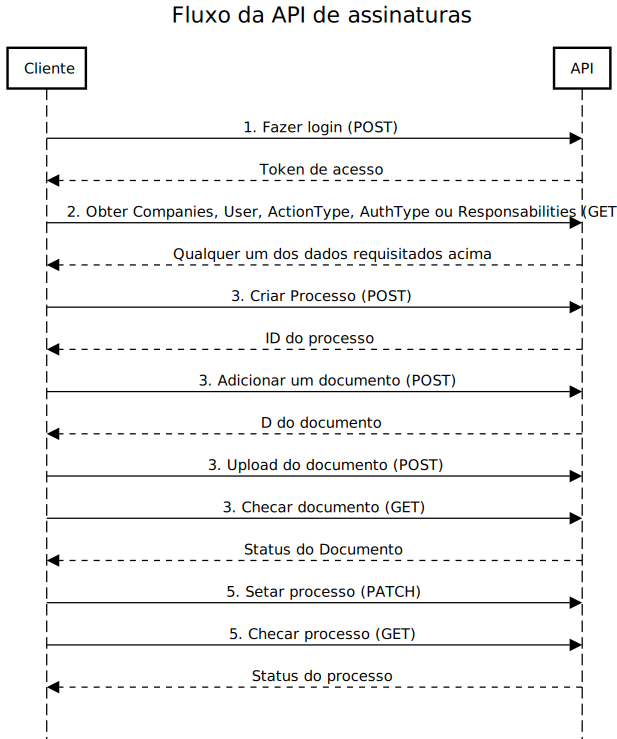

# Fluxo da aplicação

O diagrama abaixo representa o fluxo da aplicação como um todo 

...

## Fluxo da API 

## Fluxo do Banco de dados e Arquitetura

[Banco de dados + Arquitetura](banco-de-dados-e-arquitetura.md)
